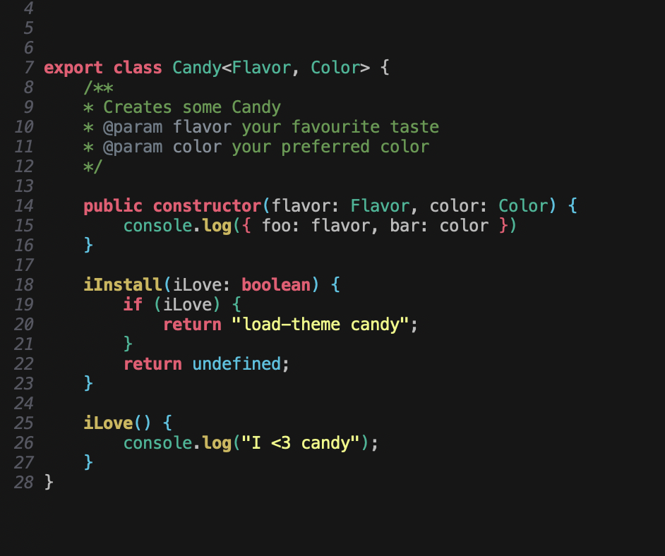

# Material candy theme [Emacs](https://www.gnu.org/software/emacs/)

> A dark theme for [Emacs](https://www.gnu.org/software/emacs/).

This theme is an port of the material candy theme by [millsp](https://github.com/millsp/material-candy) and the theme template code was taken from [dracula for emacs](https://github.com/dracula/emacs). Please consider supporting both authors.




## Install

``` emacs-lisp
(require 'candy)
(load-theme candy)
```

## Configure

Some aspects of this theme are customizable.  You can change them either
by doing `M-x customize-group candy` or setting one or more of the
following values in your Emacs init file.  Note that these variables
need to be set before `load-theme` is invoked for Candy.

```
;; Don't change the font size for some headings and titles (default t)
(setq candy-enlarge-headings nil)

;; Adjust font size of titles level 1 (default 1.3)
(setq candy-height-title-1 1.25)

;; Adjust font size of titles level 2 (default 1.1)
(setq candy-height-title-1 1.15)

;; Adjust font size of titles level 3 (default 1.0)
(setq candy-height-title-1 1.05)

;; Adjust font size of document titles (default 1.44)
(setq candy-height-doc-title 1.4)

;; Use less pink and bold on the mode-line and minibuffer (default nil)
(setq candy-alternate-mode-line-and-minibuffer t)
```
